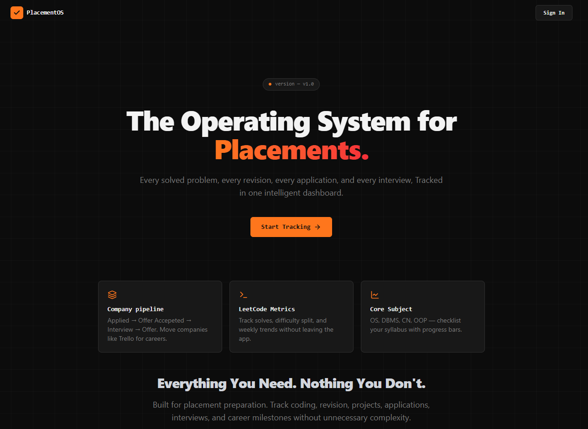
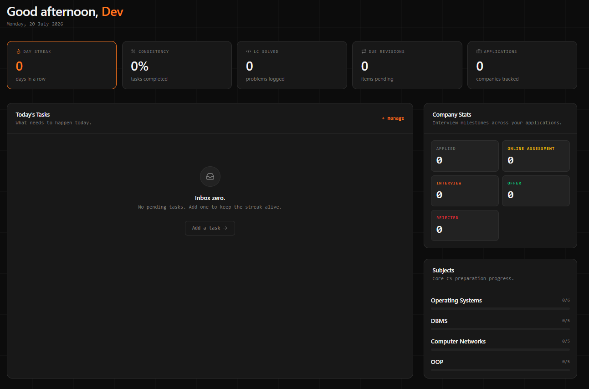
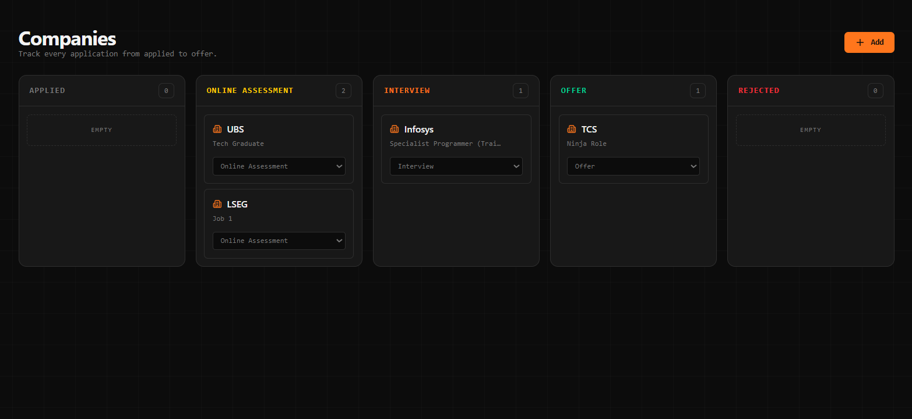
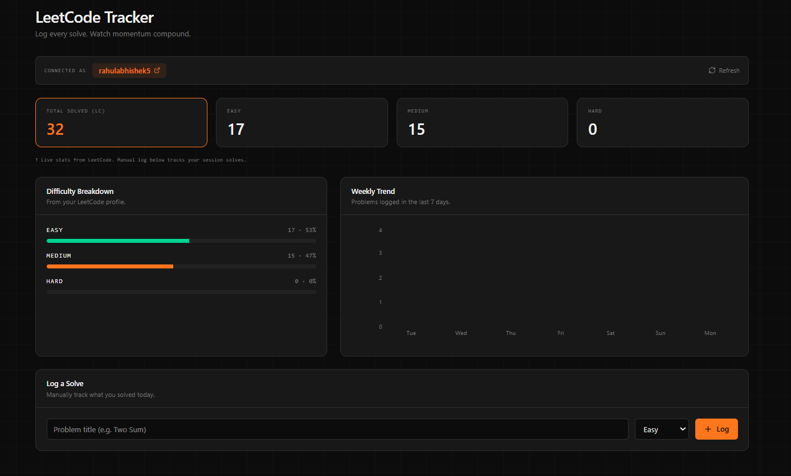
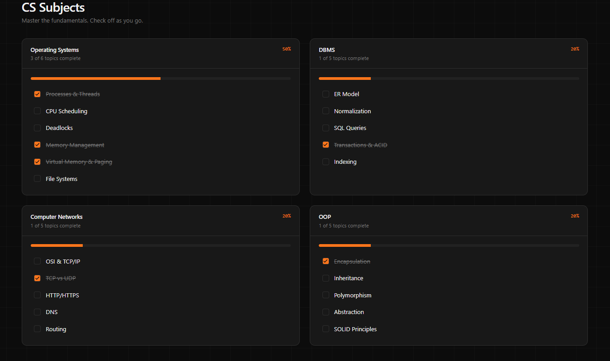

  <h1>🚀 PlacementOS</h1>
  
<strong>The Operating System for Career Placements.</strong>

  
Every solved problem, every revision, every application, and every interview — tracked in one intelligent dashboard.

   

  

    
    
    
    
    
  

<!-- 

   
  🚀 <b>Live Demo :</b> <a href="https://placement-os-one.vercel.app" target="_blank"> Placement OS </a>

 -->

> [!TIP]
> 🚀 **Visit PlacementOS Live:** Access the V1 version at [Placement OS](https://placement-os-one.vercel.app)

---

## 📖 About PlacementOS

**PlacementOS** is a streamlined, developer-first platform designed to take the chaos out of placement preparation. Instead of scattering your progress across spreadsheets, bookmarked links, and notepad files, PlacementOS brings your entire career prep pipeline under one clean, high-performance dashboard.

## ✨ Key Capabilities

<table>
  <tr>
    <td width="50%">
      <h3>🏢 Company Pipeline</h3>
      
Tracker for job applications. Effortlessly track applications through stages: <i>Applied → Interview → Offer Accepted/Rejected</i>.

    </td>
    <td width="50%">
      <h3>💻 LeetCode Metrics</h3>
      
Log problem solves, track difficulty splits (Easy/Medium/Hard), monitor weekly trends, and stay consistent with your DSA goals.

    </td>
  </tr>
  <tr>
    <td width="50%">
      <h3>📚 Core Subjects Tracker</h3>
      
Interactive syllabus checklists for essential Computer Science topics: Operating Systems, DBMS, Computer Networks, and OOPs.

    </td>
    <td width="50%">
      <h3>⚡ Real-Time Intelligence</h3>
      
A unified dashboard featuring progress bars, upcoming task lists, and instant updates powered by cloud sync.

    </td>
  </tr>
</table>

---

## 🖼️ Live Platform Preview

### 🌐 Landing Page

 

### 📊 Dashboard Page

 

### 🏢 Company Applications

 

### 💻 LeetCode & DSA Tracker

 

### 📚 CS Core Syllabus

---

## 💬 Website Reviews & Feedback

PlacementOS is live and continuously evolving! Your reviews and feedback are essential in helping me improve the website and user experience.

### 🌟 How You Can Help Improve PlacementOS:
- 🧪 **Test the Platform**: Try out the features, track your prep, and test the user flow.
- 💡 **Suggest Website Improvements**: Have an idea for a new feature, widget, or workflow integration?
- :art: **Report UI/UX Issues**: Found a bug, broken visual element, or responsiveness issue?
- 💭 **Share Your Review**: Tell us what you loved and what can be made better!

---

  <i>Built for students Preparing for Placements. Everything you need, nothing you don't.</i>

